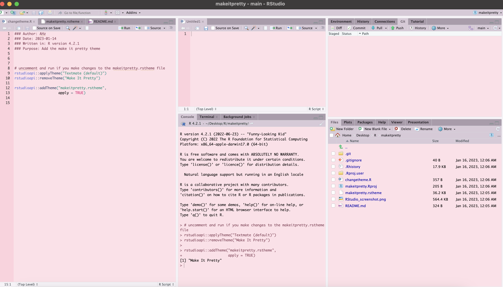

# Make It Pretty 🌸💕

an .rstheme file to make your RStudio background pink (inspired by and adapted from Atelier Heath Light by Bram de Haan in the [rstheme:: package](https://github.com/gadenbuie/rsthemes))

